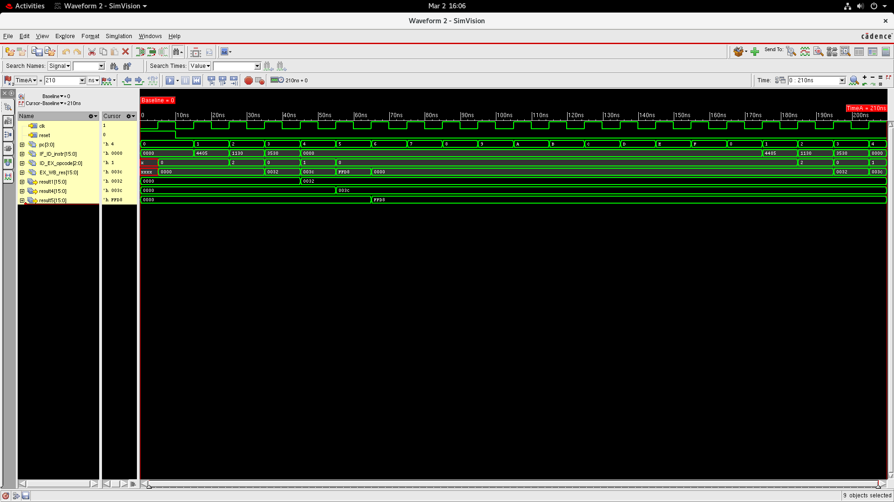
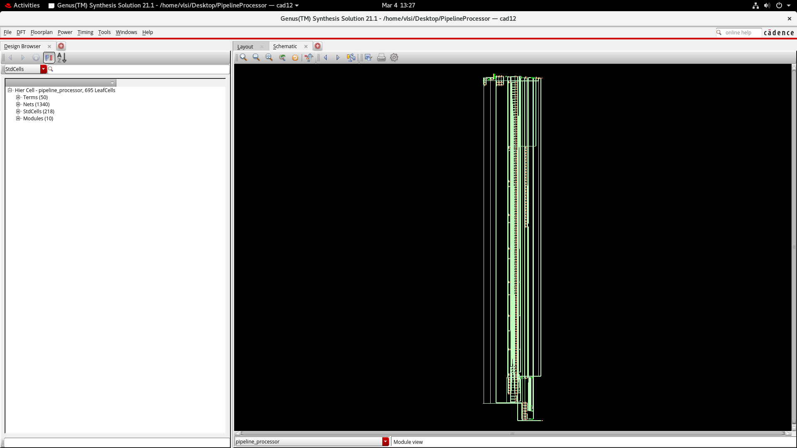

# PIPELINE-PROCESSOR-DESIGN

**COMPANY:** CODTECH IT SOLUTIONS 

**NAME:** Mallikarjun Goudappanavar

**INTERN ID:** CTIS5769

**DOMAIN:** VLSI 

**DURATION:** 4 Weeks 

**MENTOR:** Neela Santosh 

---

## 📌 Project Overview

This project presents the design and simulation of a 4-Stage Pipelined Processor using Verilog Hardware Description Language (HDL). Pipelining is a technique used in processor architecture to improve system performance by executing multiple instructions simultaneously in different stages.

The processor is designed with four pipeline stages: Instruction Fetch (IF), Instruction Decode (ID), Execute (EX), and Write Back (WB). Each stage performs a specific task in the instruction execution process.

The processor supports basic instructions such as ADD, SUB, AND, and LOAD. The design is verified using simulation waveforms and synthesized using Cadence Genus to evaluate hardware performance such as power consumption, timing, and area utilization.

---

## 🎯 Objective

- Design a 4-stage pipelined processor using Verilog HDL

- Implement basic instructions such as ADD, SUB, AND, and LOAD

- Demonstrate instruction flow through pipeline stages

- Verify processor functionality using simulation waveform

- Perform synthesis and analyze hardware performance metrics

---

## ⚙️ Tools Used

-Verilog HDL

-Cadence Genus

-SimVision

---

## 💻 Source Code
### 🔹 Processor Design (ppl.v)

Implements the 4-stage pipelined processor architecture including instruction memory, register file, arithmetic logic operations, and pipeline registers connecting each pipeline stage.

### 🔹 Testbench (ppl_tb.v)

Applies clock and reset signals to verify processor functionality and generate simulation waveforms showing instruction flow through each pipeline stage.

Source files are available in the Source_Code folder.

---

## 🧮 Supported Instructions

|Opcode	|Instruction |
| 00	  | ADD        |
| 01	  | SUB        |
| 10	  | AND        |
| 11	  | LOAD       |

---

## 🖥 Simulation Output

The waveform verifies the correct behavior of the processor and demonstrates how instructions move through the pipeline stages including Instruction Fetch, Decode, Execute, and Write Back.

---

## 🔧 RTL Schematic

The RTL schematic shows the synthesized hardware structure generated from the Verilog processor design.

---

## 📊 Synthesis Reports

Power, timing, area, and gate-level synthesis reports are available in the Synthesis_Reports folder.

---

## 📄 Project Report
 
📥 **Download Full Report:**  
[Pipelined Processor Simulation Report (PDF)](Project_Report/PIPELINED_PROCESSOR_REPORT.pdf)

---

## ✅ Results

Simulation results confirm correct execution of instructions through all pipeline stages. The processor successfully performs ADD, SUB, AND, and LOAD operations. Synthesis analysis shows efficient hardware utilization with acceptable power consumption, timing performance, and area usage.# PIPLINE-PROCESSOR-DESGIN
